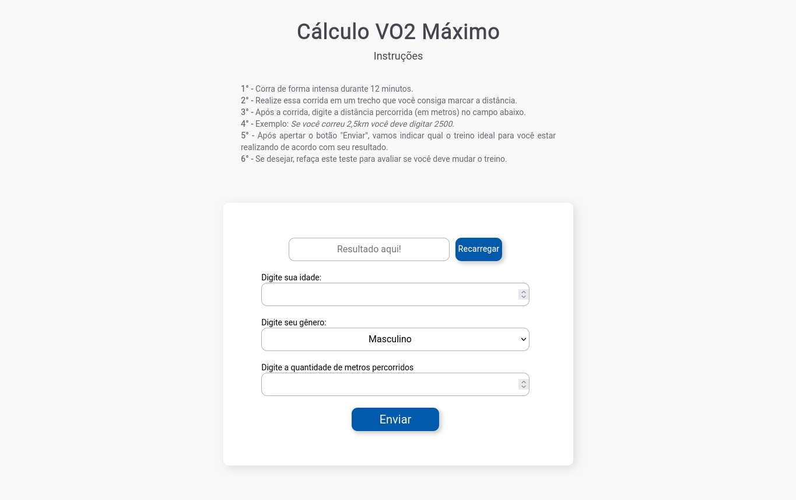

# Cálculo VO₂ Máximo

 

<h3>V = Volume</h3>
<h3>O₂ = Oxigênio</h3>
<h3>Max = Valor máximo</h3>

Quantidade máxima de oxigênio que o teu corpo pode efectivamente utilizar durante 1 minuto de atividade física. Medido em mililitros por quilograma de peso corporal por minuto.

 

<h2>O que é?</h2>

Capacidade aeróbica máxima ou consumo máximo de oxigênio. É um indicador popular de eficiência física, sendo um ótimo potencial para atletas de resistência e até mesmo um indicador de saúde futura.

 

<h2>Detalhes do Projeto</h2>

Cálculo do volume de oxigênio máximo do usuário, retornando seu rendimento físico baseado na distância percorrida, sua idade e gênero.

 

<h2>Template</h2>

<h3>Output dos Resultados: 
 
| Após o usuário inserir suas informações.

 

<h2>Tecnologias Utilizadas</h2>

