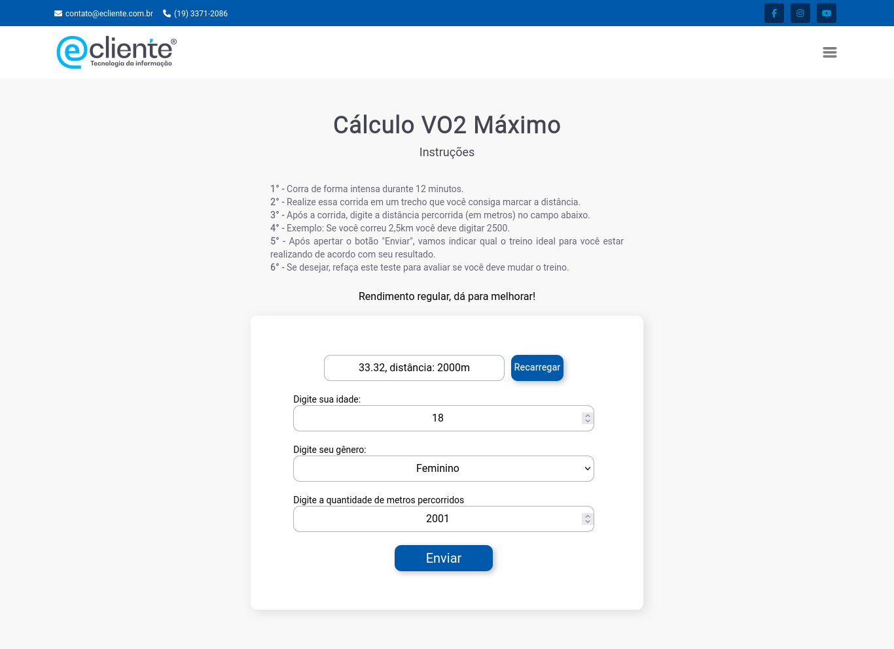

# Cálculo VO₂ Máximo

<h3>V = Volume</h3>
<h3>O₂ = Oxigênio</h3>
<h3>Max = Valor máximo</h3>

Quantidade máxima de oxigênio que o teu corpo pode efectivamente utilizar durante 1 minuto de atividade física. Medido em mililitros por quilograma de peso corporal por minuto.

Esse projeto irá demonstrar ao usuário a capacidade aeróbica máxima ou consumo máximo de oxigênio. É um indicador popular de eficiência física, sendo um ótimo potencial para atletas de resistência e até mesmo um indicador de saúde futura.

 

<h2>Detalhes do Projeto</h2>

Cálculo do volume de oxigênio máximo do usuário, retornando o cálculo e seu rendimento físico baseado na distância percorrida, sua idade e gênero, com valores de: <i>Ótimo, Bom, Regular, Ruim e Péssimo</i>.

 

<h2>Tecnologias Utilizadas</h2>

 

<h2>Template</h2>

<h3>Output dos Resultados: </h3>

| Após o usuário inserir suas informações.

 

| <b>Output Final após Alterações e Implementações</b>

 

<h2>Estudos e Anotações</h2>

<h3><i>O que é o Ajax?</i></h3>

Acrônimo para <b>JavaScript assíncrono + XML</b>. É uma forma de utilizar em conjunto algumas tecnologias, incluindo HTML ou XHTML, CSS, JavaScript, DOMl, XML, XSLT, e o mais importante: o objeto <i>XMLHttpRequest</i>.

Quando essas tecnologias são combinadas no modelo AJAX, as aplicações web que a utilizam são capazes de fazer rapidamente <b>atualizações incrementais para a interface do usuário sem recarregar a página inteira do navegador</b>. Isso torna a aplicação mais rápida e sensível às ações do usuário.

Neste método, o mais utilizado para isso é o JSON do que o XML devido às suas vantagens, como ser mais leve e ser parte do JavaScript, porém ambos são utilizados para obter informações do pacote no modelo AJAX.

O AJAX permite a troca de informações simultânea sem interferir com outras funções. Alguns exemplos de AJAX incluem: <i>votar/avaliar algum produto online, preenchimento de formulários, canais de bate-papo, notificações de trending do Twitter</i>.

 

<h3>XMLHttpRequest</h3>

Objeto que fornece funcionalidade ao cliente para transferir dados entre um cliente e um servidor. Ele oferece uma maneira fácil de recuperar dados de um URL sem ter que fazer uma atualização de página inteira. Isso permite que uma página da Web <b>atualize apenas uma parte do conteúdo sem interromper</b> o que o usuário esteja fazendo. <i>XMLHttpRequest</i> é usado constantemente na programação de AJAX.

<b>Instância de XMLHttpRequest:</b> <code>var myRequest = new XMLHttpRequest();</code>

 

<h3>json_encode</h3>

Retorna uma string contendo a representação JSON de value fornecido, transformando um valor em formato JSON. Os arrays não aceitam caracteres especiais, como acentos ou cedilha, tendo problemas de formatação de código caso deseje utilizá-los. Sempre que precisar transformar dados em uma string de texto JSON para enviar ou guardar, pode-se usar o <code>json_encode</code>.

 

<h3>Experiência</h3>

- Usei pela primeira vez uma requisição AJAX para obter os resultados do cálculo VO2 Máx e o rendimento do usuário após inserir as informações necessárias no formulário.

- Refatoração de código e uso de variáveis com strings para evitar o desperdício.
  
- Primeiro projeto usando o modelo da empresa onde estou fazendo estágio.

 

<h2>Bibliografia</h2>

<ul>
    <li><a href="https://developer.mozilla.org/pt-BR/docs/Learn/JavaScript/Client-side_web_APIs/Fetching_data">AJAX</a> by <b>MDN Web Docs</b></li>
    <li><a href="https://developer.mozilla.org/pt-BR/docs/Web/API/XMLHTTPRequest">XMLHttpRequest</a> by <b>MDN Web Docs</b></li>
    <li><a href="https://blog.matheuscastiglioni.com.br/requisicoes-ajax-com-javascript/">Requisições Ajax Com Javascript</a> by <b>Matheus Castiglioni</b></li>
    <li><a href="https://www.hostinger.com.br/tutoriais/o-que-e-ajax">O Que é AJAX e Como Funciona?</a> by <b>Hostinger</b></li>
    <li><a href="https://youtu.be/gytFVt9Z7gk?si=HhOuaamZlVfA4wWX">Requisição Ajax com Jquery e PHP</a> by <b>To Codando</b></li>
</ul>

